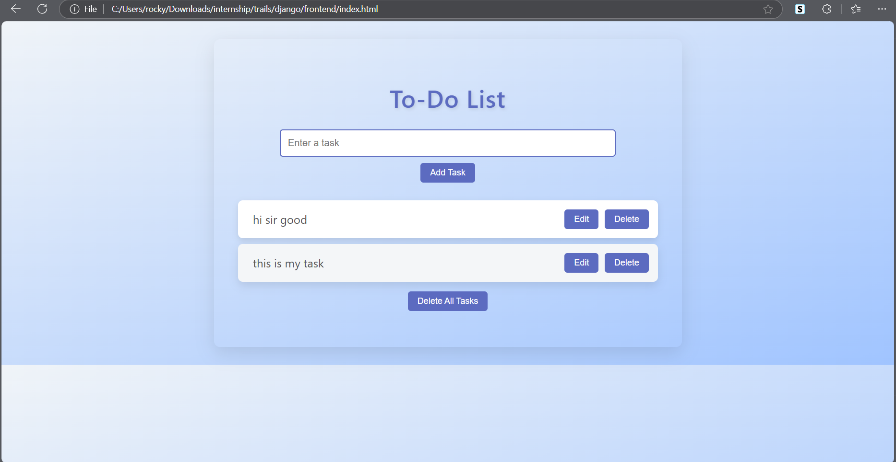

# intern-d
Here is a `README.md` file for your To-Do List project that explains how to set up and run the project:

```markdown
# To-Do List Application

This is a simple To-Do List web application where users can add, edit, and delete tasks. The project is built using **HTML**, **CSS**, and **JavaScript** to provide an interactive and responsive user interface. It communicates with a backend API (which can be built using Django or any backend technology) to manage tasks.

## Features

- Add new tasks.
- Edit existing tasks.
- Delete individual tasks.
- Delete all tasks.
- Error handling and feedback messages.

## Prerequisites

Before running the project, make sure you have the following installed:

- **A web browser** (e.g., Chrome, Firefox, Safari)
- **A local server** (for example, you can use Django or Flask if you're working with a backend API)

For the backend API (if you're using one like Django), ensure that:
- The API is running locally (on `http://127.0.0.1:8000/`).
- CORS headers are configured properly (e.g., using the `django-cors-headers` package for Django).

## File Structure

```plaintext
your-project/
│
├── index.html       # The main HTML file for the To-Do list application
├── styles.css       # The CSS file that contains all the styles
└── script.js        # The JavaScript file for the functionality of the app
```

## Setup Instructions

### 1. Clone the repository

To clone the project to your local machine, run:

```bash
git clone https://github.com/your-username/to-do-list-app.git
cd to-do-list-app
```

### 2. Set up the backend (if you have one)

Make sure your backend server (such as a Django API) is running on `http://127.0.0.1:8000/` or update the `apiBase` variable in the `script.js` file to point to your backend.

#### Example (for Django):
- Install dependencies:

```bash
pip install -r requirements.txt
```

- Run migrations and start the server:

```bash
python manage.py migrate
python manage.py runserver
```

Ensure that the API endpoints match the ones used in the JavaScript code (`GET /api/tasks/`, `POST /api/tasks/create/`, etc.).

### 3. Open the project in your browser

Once your backend is running (if applicable), simply open the `index.html` file in any web browser. You should be able to interact with the To-Do List application.

```bash
# Open the HTML file in a browser
open index.html
```

Or, if you want to serve the project using a local server (like Python's built-in HTTP server), you can run the following command:

```bash
# Python 3.x
python -m http.server
```

Then, navigate to `http://localhost:8000` in your browser.

### 4. Test the Application

You should now be able to:
- Add tasks.
- Edit tasks.
- Delete tasks.
- Delete all tasks.

If you encounter any errors or issues, check the **browser console** (press `F12` or right-click and choose "Inspect" → "Console" tab) for error messages. Also, ensure your backend API is correctly handling the requests.

## File Explanations

### `index.html`

This file contains the structure of the To-Do list web application. It includes a simple form for adding tasks and a list to display tasks. It also links to the external CSS and JavaScript files for styling and functionality.

### `styles.css`

The CSS file handles the visual appearance of the To-Do list app. It contains styles for layout, buttons, tasks, form inputs, modals, and error messages.

### `script.js`

This JavaScript file contains all the interactive logic for the To-Do list:
- **Fetch tasks** from the backend API.
- **Add a task** to the list by making a `POST` request.
- **Update a task** by making a `PUT` request.
- **Delete a task** or **delete all tasks** using `DELETE` requests.
- Display error messages when something goes wrong.

## Troubleshooting

If you encounter any issues, here are a few things to check:
- **CORS errors**: Ensure that your backend API allows cross-origin requests from your local environment. In Django, you can configure this using `django-cors-headers`.
- **API endpoint issues**: Verify that the API endpoints in the `script.js` file match your backend routes.
- **Browser issues**: Try opening the application in a different browser or clearing your browser cache.

## Contributing

Feel free to fork the repository and submit pull requests for new features or bug fixes. Please ensure that your changes do not break existing functionality.

## License

This project is open-source and available under the MIT License.

## Contact

For any questions, you can reach me at: [your-email@example.com].
```

### Key Points in the README:

1. **Project Overview**: A summary of the features of the To-Do List application.
2. **Prerequisites**: Details the required software such as browsers, backend (if applicable), and dependencies.
3. **File Structure**: Shows how the files are organized.
4. **Setup Instructions**: Provides a step-by-step guide on how to clone, set up, and run the project locally.
5. **File Explanations**: Describes the purpose of each file in the project.
6. **Troubleshooting**: Common problems users might encounter.
7. **Contributing**: Encouragement for others to contribute.
8. **License**: Information about the project's open-source license.
9. **Contact**: Information on how users can contact you for help.

You can adjust the instructions as needed to fit your project's structure and backend setup.